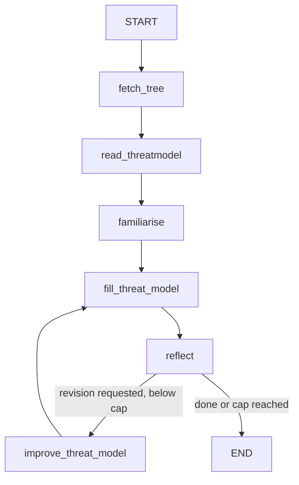

# ProjectX

A read-only repository familiarisation and preliminary threat-model workflow:



From this project directory:

```bash
uv run projectx --lang Python --repo /path/to/repository
```

`--lang` is passed to the checklist, familiarisation, improvement, threat-model, and reflection prompts.
The first node always fetches the CLI-selected repository's directory tree locally.
The next node reads the actual `ThreatModel` JSON Schema and the tree to produce
an inspection checklist. Familiarisation uses that checklist to select files
dynamically; a `ToolNode` executes reads and sends the results back to the model.
The writer fills the existing schema using the overview **and actual excerpts**.
The reflection node critiques that report against the source evidence, unless
the iteration limit has been reached.
It uses the existing `Reflection` schema (`missing` and `superfluous`), wrapped
inside a `ReflectionDecision` that adds a strict Boolean `needs_revision` and
a decision `reason`. Reflection critiques the report; it does not rewrite it.

When the model requests an improvement, a conditional edge routes to the dedicated
`improve_threat_model` node. It receives the previous report, latest critique,
earlier critique history, initial overview, collected excerpts, and read failures.
Its prompt lives in `threat_model_chain.py`. It can gather targeted additional
source evidence or use existing excerpts to recommend field-level corrections.
It stores these findings in `state["improvements"]`, separately from the initial
`state["familiarisation"]`; it does not overwrite the report itself. The next
`fill_threat_model` call writes the revised report using those findings, critique,
and accumulated evidence. Reflection reviews it again only if this is not the
final iteration. The tree, checklist, and initial familiarisation run only once.

`MAX_ITERATIONS = 5` in `graph_builder.py` counts visits to `reflect`, including
the initial draft's visit. **On the final visit, the node immediately skips the
reflection LLM call and its conditional edge routes to `END`.** That allows at most
five reports (the initial draft plus four revisions) and four critiques. The critic
can end the loop earlier by returning `needs_revision=false`, but cannot override
the numeric cap. `iteration_count` counts reflection-node visits; `revision_count`
separately counts completed replacement reports, starting at 0. File reads and tool
messages increment neither counter.

The reader's root comes from `--repo`, not a hardcoded directory or a model argument.
The model chooses `file_path` (relative to that root), `start_line`, and an optional
`max_lines`. By default, omitting `max_lines` or passing `null` reads from
`start_line` through the end of the file; omitting `start_line` starts at line 1.
`AnswerQuestion` finishes either source-reading step; it is an output schema, not a
filesystem function. The graph prints its Mermaid diagram, including the
reflection node's conditional loop and exit.
The file-reading loops run inside `familiarise` and `improve_threat_model`, with
separate prompts and state output keys. They share bounded read-execution code;
their internal tool/model turns are not separate nodes in that outer diagram.

The result of `graph.invoke(...)` contains `checklist`, `familiarisation`,
`evidence`, `read_errors`, and a validated `threat_model`. It also contains the
current report's `reflection`, `needs_revision`, `reflection_reason`,
`iteration_count`, `revision_count`, and `history`. Each actual review adds a
history entry with its iteration number, report, critique,
decision, initial overview, improvement findings, evidence IDs, and read errors.
`improvements` is present after the first improvement pass and holds the latest
findings; reviewed versions are retained in `history`. Actual excerpts accumulate in
`evidence`; their source IDs remain stable across passes.

`stop_reason` is `approved` when the critic requests no further revision, or
`max_iterations` when the final reflection visit stops without a model call. At
that limit, `reflection`, `needs_revision`, and `reflection_reason` are `None`:
the final report was not critiqued, and it must not inherit the previous report's
review as its own. Earlier reviews remain in `history`; the final report remains
in `threat_model`, with all collected excerpts in `evidence`. `approved` means
the critic accepted this preliminary discovery report or saw no useful in-scope
next step, **not** that the repository is secure or fully assessed. A capped run
has no final critique and is not implicitly approved.

The CLI currently invokes the graph without printing that result.

### Optional schema correction

The writer uses `create_agent` with `ToolStrategy(ThreatModel)` inside
`fill_threat_model`. The critic uses the same approach with
`ToolStrategy(ReflectionDecision)` inside `reflect`; this validates the nested
`Reflection` fields as well as `needs_revision` and `reason`. Both reuse their
existing prompts and evidence. When a returned schema tool call has invalid
arguments, LangChain sends the validation errors back to the model for another
attempt. This repairs output structure within a single draft or review; it does
not verify the report's claims or advance the outer reflection loop.

The following switch exists independently at the top of
`src/projectx/threat_model_chain.py` and `src/projectx/reflection_chain.py`:

```python
USE_SCHEMA_CORRECTION = True
```

Both original `.with_structured_output()` chains are preserved for rollback, so
either correction experiment can be reverted independently. Each module's
`USE_SCHEMA_CORRECTION = False` selects its original behavior: one model call
followed by validation, with parsing errors raised. There is no silent fallback
from either correction path to its original path.

There is no application-level model-call cap on schema correction. The previous
`MAX_SCHEMA_ATTEMPTS` setting and `ModelCallLimitMiddleware` have been removed
from both agents, so correction can continue beyond three calls. Each draft and
each review still gets its own message history, retaining the original evidence
and any validation feedback throughout that invocation.

The loop finishes when it obtains an accepted structured response. It can still
stop on a provider error, cancellation, or LangGraph's existing general recursion
guard; no replacement schema-attempt limit is configured. Missing tool calls or
persistently invalid output can cause many additional model calls, accumulating
context, runtime, and provider costs. Removing the schema-call cap does not add
automatic retries for provider/server errors or guarantee eventual success.

Schema correction adds no outer graph node and does not change the configured
reflection limit. Correction does not re-fetch the tree, read more files, or
advance reflection/revision counters. Only a validated report reaches the next
outer node, and only a validated `ReflectionDecision` can control routing. Failed
reflection attempts do not become separate history entries or approve the report.
On the final outer visit to `reflect`, the existing guard still ends immediately,
before creating a correction agent or calling the model. The source-reading
nodes use their own bounded tool loops, not these schema-correction agents.

### Local preview

To inspect just the tree, without model calls or LangSmith tracing:

```bash
uv run projectx --lang Python --repo /path/to/repository --preview
```

Normal runs read selected text files; preview still lists names only. Each saved
excerpt includes its relative path, line range, exact content, a file-snapshot
SHA-256, and a source ID. The overview and report prompts request source citations,
but citations and interpretations still need human review. Pydantic validates
structure, not truth. Unread files, runtime behaviour, deployed settings, and
unperformed tests or advisory searches must remain unknown/not assessed.

The file reader has no file-size, returned-character, or returned-line cap by
default. These settings remain independently configurable near the top of
`src/projectx/tool_executor.py`:

```python
MAX_FILE_BYTES: int | None = None
MAX_READ_CHARS: int | None = None
MAX_READ_LINES: int | None = None
```

`None` disables that limit. To restore selected caps, set them to positive integers;
for example, `MAX_FILE_BYTES = 256 * 1024` refuses files larger than 256 KiB,
`MAX_READ_CHARS = 2000` caps the returned source characters, and
`MAX_READ_LINES = 100` caps the returned lines. Restart the program after editing
these settings. When a line cap is configured, omitted or `null` `max_lines` uses
that cap instead of reading through EOF. The model can still request a shorter
range with a positive `max_lines`; explicit requests remain subject to configured
caps. With character limits disabled, long lines are not cut off. If a character
cap is re-enabled, a long line may be returned only as a prefix; line-based
pagination cannot recover its remainder.

The graph's separate limits remain at most 25 read calls and 10 model turns per
familiarisation or improvement pass (`graph_builder.py`). The run fails if the
model exceeds its budget or the initial pass finishes without a successful
nonempty read. Improvement passes can finish without new reads when the existing
evidence suffices, avoiding unnecessary model/tool work. Refused reads are returned
to the model as tool errors; they do not become source evidence. These limits do
not guarantee whole-repository coverage or impose a wall-clock deadline on
provider requests.

Removing reader caps does not give the model unlimited context. Full files can
consume substantial process memory, and retained evidence is included in later
prompts, increasing token usage, latency, and cloud costs. Large trees, checklists,
reports, critiques, and accumulated source evidence must still fit the chosen
model's context window. Prefer targeted line ranges or re-enable caps when
appropriate. Provider context handling and model adherence need live evaluation;
no model-call or wall-clock performance guarantee is implied.

The reader is a restricted `ReadFileTool` subclass. It refuses paths outside the
selected root, symlinks, non-regular/binary files, common generated directories,
and known secret/credential paths such as `.env`. It does not interpret `.gitignore`
or detect every possible embedded secret. Use a curated, secret-free repository
copy; keep it unchanged during a run. Path rules are not an OS-level sandbox.

All chains import the shared model from `src/projectx/llm.py`. Change the model,
reasoning, timeouts, or provider there, then restart the program. Your active
provider configuration and commented alternatives are preserved;
keep exactly one `llm = ...` block uncommented. Prompts, tool bindings, and output
schemas remain in their respective chain modules. Normal runs send the tree,
checklist, reports, critiques, and selected source
excerpts to the configured cloud model providers and potentially LangSmith when
tracing is enabled; only use repositories approved for that sharing. Configure
provider credentials in your environment or `.env`. No repository code is executed.

Offline tests (no model calls):

```bash
uv run python -m unittest discover -s tests -v
```
